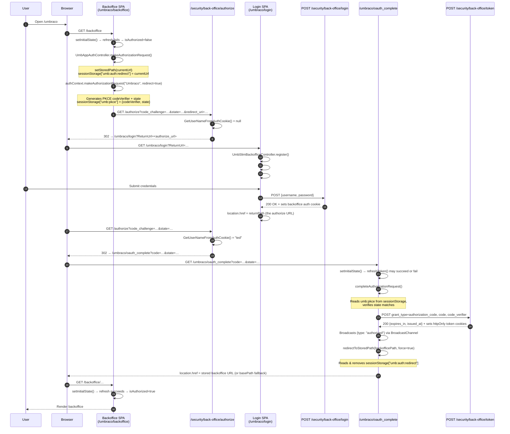
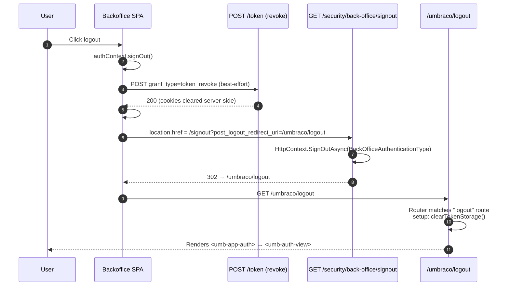
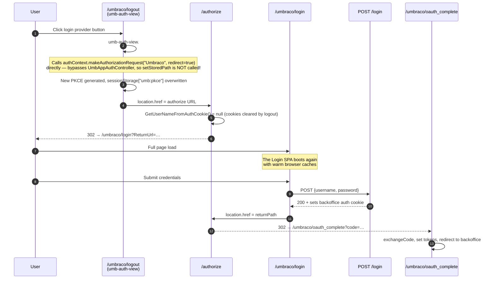
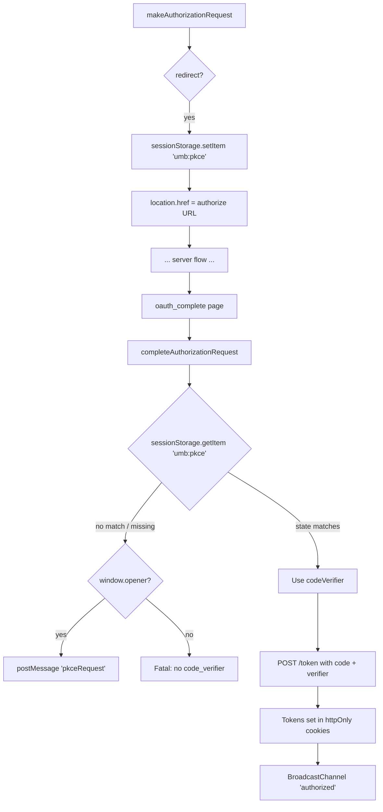

# Umbraco Login Flow — Deep Dive

This document is a comprehensive walkthrough of how the Umbraco 18 backoffice login works end-to-end: the two SPAs involved, the OAuth 2.0 + PKCE handshake, cookie/session management, the localisation registry's loading behaviour, and the hook points Le Løgin uses to customise the experience.

All source links are pinned to the `release-18.1.0` tag, so they stay checkable as upstream moves on. Re-pin them when this package targets a new Umbraco major.

Where live traffic in this repository differs from the tag, prefer the live environment. The routes below are the observed ones: the backoffice SPA's router is mounted under the `/umbraco/` base, so its routes surface as `/umbraco/logout` and `/umbraco/oauth_complete` — **not** `/umbraco/backoffice/logout` and `/umbraco/backoffice/oauth_complete`. Verified by request against a running site.

---

## 1. The Two Frontends

Umbraco runs **two separate Lit/Web-Component SPAs** for authentication:

| App | Served at | Source root | Purpose |
| --- | --- | --- | --- |
| **Login SPA** (a.k.a. "slim backoffice") | `/umbraco/login`, password-reset, invite | [`src/Umbraco.Web.UI.Login`](https://github.com/umbraco/Umbraco-CMS/tree/release-18.1.0/src/Umbraco.Web.UI.Login) | Username/password form, MFA prompts, reset flows. Public — no auth required. |
| **Backoffice SPA** | `/umbraco/**`, `/umbraco/oauth_complete`, `/umbraco/logout` | [`src/Umbraco.Web.UI.Client/src/apps/app`](https://github.com/umbraco/Umbraco-CMS/tree/release-18.1.0/src/Umbraco.Web.UI.Client/src/apps/app) | Authenticated app. Also handles OAuth callback (`/oauth_complete`) and post-logout view via `umb-auth-view`. |

**Critical point**: navigating between the two SPAs is always a **full page reload**. Module-level state (caches, the `UmbAuthContext` instance, PKCE in `UmbAuthClient`) is reset on each load. `sessionStorage` persists across these reloads (same tab); cookies persist (subject to the server's expiry/clear semantics).

### Initialisation differences

The Login SPA uses a stripped-down "slim backoffice" controller because it must run **before** authentication:

[`slim-backoffice-initializer.ts`](https://github.com/umbraco/Umbraco-CMS/blob/release-18.1.0/src/Umbraco.Web.UI.Login/src/controllers/slim-backoffice-initializer.ts):

```typescript
export class UmbSlimBackofficeController extends UmbControllerBase {
    constructor(host: UmbElement) {
        super(host);
        umbExtensionsRegistry.registerMany(umbLocalizationManifests);
        new UmbBundleExtensionInitializer(host, umbExtensionsRegistry);
        new UUIIconRegistryEssential().attach(host);
        host.classList.add('uui-text', 'uui-font');
    }

    async register(host: UmbElement) {
        // ...
        await new UmbServerExtensionRegistrator(this, umbExtensionsRegistry)
            .registerPublicExtensions();  // ← fetches public umbraco-package.json files
        new UmbAppEntryPointExtensionInitializer(host, umbExtensionsRegistry);
        // ↑ NOT awaited — appEntryPoint loading is fire-and-forget
    }
}
```

The Backoffice SPA's [`app.element.ts`](https://github.com/umbraco/Umbraco-CMS/blob/release-18.1.0/src/Umbraco.Web.UI.Client/src/apps/app/app.element.ts) does the **full** boot — it also runs `registerPublicExtensions()` + `UmbAppEntryPointExtensionInitializer`, **plus** all the authenticated-only bundles.

In Umbraco generally, a public extension can become visible to both SPAs because both call `registerPublicExtensions()`. Le Løgin used that model historically, but the current package no longer ships a public login-page `appEntryPoint`; see §7 for the current server-side-only setup.

---

## 2. The Two "Login Views"

What looks like "the login page" to a user can actually be one of two distinct DOM elements:

```
┌──────────────────────────────────────────────────────────────────────┐
│  /umbraco/login   (Login SPA)                                         │
│  ├── <umb-auth>           ← UmbAuthElement                            │
│  │     └── <umb-login-page>     ← UmbLoginPageElement                 │
│  │           └── <slot>           ← form injected here by JS          │
│  │                                  via #initializeForm() (see §3.3)  │
└──────────────────────────────────────────────────────────────────────┘

┌──────────────────────────────────────────────────────────────────────┐
│  /umbraco/logout   (Backoffice SPA logout route)                      │
│  ├── <umb-app-auth>       ← UmbAppAuthElement                         │
│  │     └── <umb-auth-view>     ← UmbAuthViewElement                   │
│  │           └── <umb-extension-slot type="authProvider">             │
│  │                 (renders provider buttons, no username/pw form)    │
└──────────────────────────────────────────────────────────────────────┘
```

- **`<umb-auth>` / `<umb-login-page>`** ([`login.page.element.ts`](https://github.com/umbraco/Umbraco-CMS/blob/release-18.1.0/src/Umbraco.Web.UI.Login/src/components/pages/login.page.element.ts)) — full username/password form. POSTs credentials directly.
- **`<umb-auth-view>`** ([`umb-auth-view.element.ts`](https://github.com/umbraco/Umbraco-CMS/blob/release-18.1.0/src/Umbraco.Web.UI.Client/src/packages/core/auth/components/umb-auth-view.element.ts)) — provider-button view inside the backoffice. Clicking a button **starts a fresh OAuth redirect**; it does NOT submit credentials directly. The credentials form is reached only after the OAuth redirect lands on `/umbraco/login`.

The two do **not** share an implementation of the chrome. `umb-login-page` sits inside the login SPA's `umb-auth-layout`; `umb-auth-view` implements its own background, greeting, and logo markup and honours only a subset of the `--umb-login-*` variables (`umb-auth-layout` does not exist in the backoffice package at all). That is why a customisation applied through those CSS variables does not automatically cover both screens — and why Le Løgin replaces assets at the source endpoints instead.

---

## 3. The First-Login Flow (Full E2E)



### 3.1 Generating the authorisation URL

[`umb-auth-client.ts`](https://github.com/umbraco/Umbraco-CMS/blob/release-18.1.0/src/Umbraco.Web.UI.Client/src/packages/core/auth/umb-auth-client.ts):

```typescript
async buildAuthorizationUrl(identityProvider: string, usernameHint?: string): Promise<string> {
    this.#codeVerifier = generateRandom(128);
    this.#state = generateRandom(32);
    const codeChallenge = await deriveChallenge(this.#codeVerifier);

    const params = new URLSearchParams({
        client_id: this.#clientId,         // 'umbraco-back-office'
        redirect_uri: this.#redirectUri,    // observed: /umbraco/oauth_complete
        scope: this.#scope,                 // 'offline_access'
        response_type: 'code',
        state: this.#state,
        code_challenge: codeChallenge,
        code_challenge_method: 'S256',
        prompt: 'consent',
        access_type: 'offline',
    });

    return `${this.#endpoints.authorizationEndpoint}?${params.toString()}`;
}
```

**PKCE state lives in two places:**

1. **Memory** — `UmbAuthClient` private fields `#codeVerifier`, `#state`. Lost on page navigation.
2. **`sessionStorage["umb:pkce"]`** — persisted only for **redirect flows**. Survives same-tab navigation; this is what the `oauth_complete` page reads back. Stored by [`auth.context.ts`](https://github.com/umbraco/Umbraco-CMS/blob/release-18.1.0/src/Umbraco.Web.UI.Client/src/packages/core/auth/auth.context.ts) `makeAuthorizationRequest()`:

```typescript
if (redirect) {
    sessionStorage.setItem('umb:pkce', JSON.stringify({
        codeVerifier: this.#client.codeVerifier,
        state: this.#client.state,
    }));
    location.href = redirectUrl;
    return;
}
```

### 3.2 The server-side authorize endpoint

[`BackOfficeController.cs`](https://github.com/umbraco/Umbraco-CMS/blob/release-18.1.0/src/Umbraco.Cms.Api.Management/Controllers/Security/BackOfficeController.cs):

```csharp
[AllowAnonymous]
[HttpGet("authorize")]
public async Task<IActionResult> Authorize(CancellationToken cancellationToken)
{
    var request = context.GetOpenIddictServerRequest();
    return request.IdentityProvider.IsNullOrWhiteSpace()
        ? await AuthorizeInternal(request)
        : await AuthorizeExternal(request);
}

private async Task<IActionResult> AuthorizeInternal(OpenIddictRequest request)
{
    var userName = await GetUserNameFromAuthCookie();
    if (userName != null)
    {
        var backOfficeUser = await _backOfficeUserManager.FindByNameAsync(userName);
        if (backOfficeUser != null)
        {
            return await SignInBackOfficeUser(backOfficeUser, request);
        }
    }
    return DefaultChallengeResult();
}

private async Task<string?> GetUserNameFromAuthCookie()
{
    var cookieAuthResult = await HttpContext.AuthenticateAsync(
        Constants.Security.BackOfficeAuthenticationType);
    return cookieAuthResult.Succeeded
        ? cookieAuthResult.Principal?.Identity?.Name
        : null;
}

private static IActionResult DefaultChallengeResult() =>
    new ChallengeResult(Constants.Security.BackOfficeAuthenticationType);
```

The flow:
- **No backoffice cookie** → `DefaultChallengeResult()` → ASP.NET Core authentication middleware redirects to `/umbraco/login?ReturnUrl=<current_url>`.
- **Has valid backoffice cookie** → `SignInBackOfficeUser()` → OpenIddict generates an auth code and 302s to `redirect_uri?code=…&state=…`.

### 3.3 The Login SPA bootstrap

[`auth.element.ts`](https://github.com/umbraco/Umbraco-CMS/blob/release-18.1.0/src/Umbraco.Web.UI.Login/src/auth.element.ts):

```typescript
async firstUpdated() {
    await new UmbSlimBackofficeController(this).register(this);
    umbExtensionsRegistry.registerMany(extensions); // login-bundle extensions
    await this.#waitForLocalization();              // ← THE 2-SECOND POLL
    this.#initializeForm();
}

async #waitForLocalization(): Promise<void> {
    return new Promise((resolve, reject) => {
        let retryCount = 0;
        const maxRetries = 40;  // 40 × 50ms = 2s total
        const checkInterval = setInterval(() => {
            if (retryCount > maxRetries) {
                clearInterval(checkInterval);
                reject('Localization not available');
                return;
            }
            if (this.localize.term('login_showPassword') !== 'login_showPassword') {
                clearInterval(checkInterval);
                resolve();
                return;
            }
            retryCount++;
        }, 50);
    });
}
```

`#initializeForm()` builds the username + password inputs imperatively and inserts them into `<umb-login-page>`'s slot:

```typescript
#initializeForm() {
    const usernameInput = createInput({...});
    const passwordInput = createInput({...});
    const form = document.createElement('form');
    form.id = 'umb-login-form';
    form.appendChild(usernameLayoutItem);
    form.appendChild(passwordLayoutItem);
    this.insertAdjacentElement('beforeend', form);
}
```

If `#waitForLocalization()` rejects, `firstUpdated()` throws and `#initializeForm()` **never runs**. The user sees the login chrome (greeting, background, logo) but **no input fields**.

### 3.4 The login POST

[`login.page.element.ts`](https://github.com/umbraco/Umbraco-CMS/blob/release-18.1.0/src/Umbraco.Web.UI.Login/src/components/pages/login.page.element.ts):

```typescript
#handleSubmit = async (e: SubmitEvent) => {
    e.preventDefault();
    const response = await this.#authContext.login({ username, password, persist });
    if (response.error) return;
    const returnPath = this.#authContext.returnPath;
    if (returnPath) {
        location.href = returnPath;
    }
};
```

[`auth.repository.ts`](https://github.com/umbraco/Umbraco-CMS/blob/release-18.1.0/src/Umbraco.Web.UI.Login/src/contexts/auth.repository.ts):

```typescript
public async login(data: LoginRequestModel): Promise<LoginResponse> {
    const request = new Request('/umbraco/management/api/v1/security/back-office/login', {
        method: 'POST',
        body: JSON.stringify({ username: data.username, password: data.password }),
        headers: { 'Content-Type': 'application/json' },
    });
    const response = await fetch(request);
    // ... handle 402 (MFA), error cases ...
    return { status: response.status, data: { username: data.username } };
}
```

The `returnPath` is computed from URL parameters:

```typescript
get returnPath(): string {
    const params = new URLSearchParams(window.location.search);
    let returnPath = params.get('ReturnUrl') ?? params.get('returnPath') ?? this.#returnPath;
    if (!returnPath) return '';
    const url = new URL(returnPath, window.location.origin);
    if (url.origin !== window.location.origin) return ''; // same-origin guard
    return url.toString();
}
```

If `ReturnUrl` is empty (e.g. the user hit `/umbraco/login` directly), nothing happens after a successful login — the user **stays on the login page**.

### 3.5 The `oauth_complete` handler

[`app.element.ts`](https://github.com/umbraco/Umbraco-CMS/blob/release-18.1.0/src/Umbraco.Web.UI.Client/src/apps/app/app.element.ts):

```typescript
{
    path: 'oauth_complete',
    component: UmbAppOauthElement,
    setup: async (component) => {
        const searchParams = new URLSearchParams(window.location.search);
        const hasCode = searchParams.has('code');
        if (!hasCode) {
            (component as UmbAppOauthElement).failure = true;
            return;
        }
        // Skip code exchange if already authorized (e.g. refresh succeeded).
        if (this.#authContext.getIsAuthorized()) {
            redirectToStoredPath(this.backofficePath, true);
            return;
        }
        const result = await this.#authContext.completeAuthorizationRequest();
        if (result === null) {
            redirectToStoredPath(this.backofficePath, true);
            return;
        }
        redirectToStoredPath(this.backofficePath, true);
    },
}
```

[`completeAuthorizationRequest`](https://github.com/umbraco/Umbraco-CMS/blob/release-18.1.0/src/Umbraco.Web.UI.Client/src/packages/core/auth/auth.context.ts) reads PKCE from `sessionStorage` (preferred) or `window.opener` (popup flow), then POSTs to the token endpoint:

```typescript
async completeAuthorizationRequest(): Promise<UmbTokenEndpointResponse | null> {
    const searchParams = new URLSearchParams(window.location.search);
    const code = searchParams.get('code');
    const state = searchParams.get('state');
    if (!code) return null;

    let codeVerifier: string | undefined;
    const pkceData = sessionStorage.getItem('umb:pkce');
    if (pkceData) {
        const parsed = JSON.parse(pkceData);
        if (parsed.state === state) {
            codeVerifier = parsed.codeVerifier;
            sessionStorage.removeItem('umb:pkce');
        }
    }
    if (!codeVerifier && window.opener) {
        codeVerifier = await this.#requestCodeVerifierFromOpener(state);
    }
    if (!codeVerifier) return null;

    const response = await this.#client.exchangeCode(code, codeVerifier);
    if (!response) return null;

    this.#setSessionLocally(response.expiresIn, response.issuedAt);
    this.#isAuthorized.setValue(true);
    this.#channel.postMessage({ type: 'authorized', /* … */ });
    return response;
}
```

### 3.6 Storage of tokens (cookies, not localStorage)

`exchangeCode()` POSTs to `/security/back-office/token`. The server's response carries timing only (`expires_in`, `issued_at`) — the actual access/refresh tokens are written into **httpOnly cookies** server-side. JS never sees them.

When the client later wants to refresh, it POSTs `grant_type=refresh_token` with `refresh_token=[redacted]`. The server intercepts the request and substitutes the real token from the httpOnly cookie (see `HideBackOfficeTokensHandler` in [`Umbraco.Cms.Api.Common`](https://github.com/umbraco/Umbraco-CMS/blob/release-18.1.0/src/Umbraco.Cms.Api.Common/DependencyInjection/HideBackOfficeTokensHandler.cs)):

```typescript
async refreshToken(): Promise<UmbTokenEndpointResponse | undefined> {
    const body = new URLSearchParams({
        client_id: this.#clientId,
        redirect_uri: this.#redirectUri,
        grant_type: 'refresh_token',
        refresh_token: '[redacted]',  // server swaps this for the cookie token
    });
    return this.#performTokenRequest(body);
}
```

---

## 4. The Logout Flow



[`signOut` in auth.context.ts](https://github.com/umbraco/Umbraco-CMS/blob/release-18.1.0/src/Umbraco.Web.UI.Client/src/packages/core/auth/auth.context.ts):

```typescript
async signOut(): Promise<void> {
    await this.#client.revokeToken().catch(() => {});
    this.#session.setValue(undefined);
    this.#isAuthorized.setValue(false);
    this.#channel.postMessage({ type: 'signedOut' });

    const postLogoutRedirectUri = new URL(this.#postLogoutRedirectUri, window.location.origin);
    const endSessionEndpoint = `${this.#serverUrl}/umbraco/management/api/v1/security/back-office/signout`;
    const postLogoutLocation = new URL(endSessionEndpoint);
    postLogoutLocation.searchParams.set('post_logout_redirect_uri', postLogoutRedirectUri.href);
    location.href = postLogoutLocation.href;
}
```

The logout route renders the **backoffice's `umb-auth-view`**, NOT the standalone login page. The user sees a provider-selection screen ("Log in with Umbraco") still inside the backoffice SPA at `/umbraco/logout`.

---

## 5. The Second-Login Flow (Post-Logout)



### Critical differences vs the first login

1. **`setStoredPath` is NOT called.** `umb-auth-view.#onSubmit` calls `authContext.makeAuthorizationRequest` directly, not via `UmbAppAuthController.makeAuthorizationRequest` (which is the only path that sets the stored redirect URL). After the OAuth round-trip, `redirectToStoredPath` reads an empty value and falls back to `basePath`.

   [`umb-auth-view.element.ts`](https://github.com/umbraco/Umbraco-CMS/blob/release-18.1.0/src/Umbraco.Web.UI.Client/src/packages/core/auth/components/umb-auth-view.element.ts):

   ```typescript
   #onSubmit = async (providerOrManifest, loginHint?) => {
       const authContext = await this.getContext(UMB_AUTH_CONTEXT);
       const providerName = typeof providerOrManifest === 'string'
           ? providerOrManifest
           : providerOrManifest.forProviderName;
       const isTimedOut = this.userLoginState === 'timedOut';
       // Note: bypasses UmbAppAuthController — no setStoredPath() call
       await authContext.makeAuthorizationRequest(providerName, isTimedOut ? false : true, loginHint, manifest);
       // ...
   };
   ```

2. **Browser cache is warm.** Umbraco's login assets and any previously fetched package assets load much faster on the second pass. Historically Le Løgin also shipped login-page JavaScript, and that exposed a localisation-registry race on warm-cache loads (an `appEntryPoint`-registered `localization` extension with a top-level `await` blocked the registry's `Promise.all`, timing out `#waitForLocalization()` — see §6). The current package no longer ships that login-page `appEntryPoint`; the login customisation path is now server-side only. See §7 for the current architecture.

3. **`storedPath` cleanup quirk** — `retrieveStoredPath()` actively rejects any stored path ending with `'logout'`:

   ```typescript
   currentRoute = savedRoute.endsWith('logout') ? currentRoute : savedRoute;
   ```

   This prevents an infinite redirect loop if `setStoredPath` ever captured the logout URL.

---

## 6. The Localisation Registry's `Promise.all` (Critical Mechanism)

The Umbraco localisation system is the moving piece that interacts with Le Løgin's appEntryPoint. Understanding its loading model is mandatory for any third-party extension that registers localisation.

[`localization.registry.ts`](https://github.com/umbraco/Umbraco-CMS/blob/release-18.1.0/src/Umbraco.Web.UI.Client/src/packages/core/localization/registry/localization.registry.ts):

```typescript
this.#subscription = this.currentLanguage
    .pipe(
        filter((currentLanguage) => !!currentLanguage),
        distinctUntilChanged(),
        tap((currentLanguage) => {
            umbLocalizationManager.documentLanguage = baseLocaleOf(currentLanguage);
        }),
        switchMap((currentLanguage) => {
            return extensionRegistry.byType('localization').pipe(
                map((extensions) => {
                    // filter to extensions matching the current language
                    const baseName = locale.baseName.toLowerCase();
                    const language = locale.language.toLowerCase();
                    return extensions.filter((ext) => {
                        const culture = ext.meta.culture.toLowerCase();
                        return culture === UMB_DEFAULT_LOCALIZATION_CULTURE
                            || culture === baseName
                            || culture === language;
                    });
                }),
            );
        }),
        filter((extensions) => extensions.length > 0),
        distinctUntilChanged((prev, curr) => {
            const prevAliases = prev.map((ext) => ext.alias).sort();
            const currAliases = curr.map((ext) => ext.alias).sort();
            return this.#arraysEqual(prevAliases, currAliases);
        }),
        switchMap((extensions) =>
            from((async () => {
                // ← THE CRITICAL Promise.all
                const translations = await Promise.all(extensions.map(this.#loadExtension));
                if (!translations.length) return;
                translations.sort((a, b) => b.$weight - a.$weight);
                umbLocalizationManager.registerManyLocalizations(translations);
                this.#setBrowserLanguage(locale!, translations);
            })()),
        ),
        catchError(/* … */),
    )
    .subscribe();

#loadExtension = async (extension: ManifestLocalization) => {
    const innerDictionary: UmbLocalizationFlatDictionary = {};
    // Inline dictionaries are processed synchronously.
    if (extension.meta.localizations) {
        for (const [name, dict] of Object.entries(extension.meta.localizations)) {
            addOrUpdateDictionary(innerDictionary, name, dict);
        }
    }
    // js: () => import(...) is awaited — top-level awaits in the imported
    // module block #loadExtension and therefore Promise.all.
    if (extension.js) {
        const loadedExtension = await loadManifestPlainJs(extension.js);
        if (loadedExtension && hasDefaultExport(loadedExtension)) {
            for (const [name, dict] of Object.entries(loadedExtension.default)) {
                addOrUpdateDictionary(innerDictionary, name, dict);
            }
        }
    }
    return { $code: extension.meta.culture.toLowerCase(), $weight: extension.weight ?? 100, ...innerDictionary };
};
```

### Implications

- **`Promise.all` is all-or-nothing.** No translations are merged into `umbLocalizationManager` until every extension for the active culture has finished loading.
- **`switchMap` cancels in-flight loads.** If a new localisation extension is registered *while* an earlier `Promise.all` is running, the entire previous load is unsubscribed and a fresh `Promise.all` starts containing every current extension.
- **`distinctUntilChanged` keys on alias sets.** Subsequent registrations only re-trigger if the alias set changes.
- **`js: () => import(...)` modules with top-level await block the batch.** The dynamic import resolves only after the module's top-level await settles — and `Promise.all` waits for it.

### Weight semantics (counterintuitive)

Lower weight wins. `translations.sort((a, b) => b.$weight - a.$weight)` sorts DESCENDING by weight, then `registerManyLocalizations` merges in that order — the LAST entry applied (lowest weight) overrides earlier ones. Built-in extensions ship at `weight: 100`; an override uses a lower weight (e.g. `weight: 0`).

---

## 7. Le Løgin's Hooks Into This System

The Le Løgin package registers a **single** entry point in [`Client/public/umbraco-package.json`](../Client/public/umbraco-package.json):

```json
{
    "name": "Le Løgin",
    "id": "le-løgin",
    "allowPublicAccess": true,
    "extensions": [
        {
            "type": "backofficeEntryPoint",
            "alias": "LeLøgin.EntryPoint.Backoffice",
            "js": "/App_Plugins/le-løgin/backoffice.js"
        }
    ]
}
```

The `backofficeEntryPoint` runs only in the authenticated backoffice and registers sections, dashboards, workspaces, and trees. Its `js` is rewritten at build time to the hashed filename, since Umbraco imports that URL verbatim with no version query.

The standalone login page has no public extension entry point. Instead the package-owned Razor override replaces Umbraco's `login.js` script tag with the package's *separate* `login.js` entry, which resolves the greeting and then imports Umbraco's bundle itself, so the first greeting render is already correct. The two entries are built independently so neither screen downloads the other's code, and `login.js` keeps a stable filename because the Razor view references it by name.

### Package login customisation surface

The image and logo hooks live under [`Core/Runtime/`](../Core/Runtime/) and are wired up in [`LeLøginScreenComposer`](../Core/LoginScreenComposer.cs). The standalone greeting bootstrap is the package Razor override.

| Customisation | Hook | Mechanism |
| --- | --- | --- |
| Background image | [`LeLøginBackgroundMiddleware`](../Core/Runtime/LoginBackgroundMiddleware.cs) | Intercepts `GET /umbraco/management/api/v1/security/back-office/graphics/login-background` (pre-routing). When a rule-matched Le Løgin background asset exists, 302-redirects to its ImageSharp-processed public URL so focal-point / zoom crops are preserved. No match → falls through to Umbraco's `BackOfficeGraphicsController`. |
| Logo | [`LeLøginLogoMiddleware`](../Core/Runtime/LoginLogoMiddleware.cs) | Intercepts both `/login-logo` and `/login-logo-alternative`. The logo is configured per background asset — the active background's `LogoAssetId` selects which logo file to stream. Path is confined to `App_Data/LeLøgin/assets/`; `X-Content-Type-Options: nosniff` is set. Both endpoints return the same bytes; Le Løgin has a single logo concept, not a primary/alternative split. |
| Greeting text | [`umbraco/UmbracoLogin/Index.cshtml`](../umbraco/UmbracoLogin/Index.cshtml) + `RuntimeController.GreetingModule` | The package Razor override replaces Umbraco's own `login.js` script tag with the package's `login.js` entry, which registers a `localization` manifest for the culture on `data-le-login-culture`, resolves `/umbraco/le-løgin/api/v1/runtime/greeting.js`, then awaits the culture load before `umb-auth` connects. The endpoint resolves the active asset per request and serves `export default { login: { greeting0..6 } }` with `Cache-Control: no-store`. If no greeting is configured the module exports an empty object and Umbraco's defaults render unchanged. |

### One namespace: `login`

In Umbraco 18 both `/umbraco/login` and the logout view (`umb-auth-view`) read `login_greeting0..6`; `auth_greeting*` survives only as a deprecated fallback that logs a console warning and is removed in v20 ([#20082](https://github.com/umbraco/Umbraco-CMS/issues/20082)). The greeting module therefore emits the `login` namespace only. (Pre-18, the two screens read different namespaces — that dual-override workaround is obsolete.) Note that sharing a namespace does **not** mean Le Løgin customises the logout view: no package client code runs in that shell — see "Screens Le Løgin does not customise" in [umbraco-login-customisation.md](umbraco-login-customisation.md).

### Cache invalidation: none, by design

Greeting freshness — asset swaps, weekday/month rule flips, and multi-instance hosting — comes entirely from the greeting module endpoint resolving per request. Which image a multi-image *random* rule lands on is pinned by the render token instead, so the background, logo, and greeting of one screen always agree. The bootstrap is package static content and never needs Umbraco's aggregate package-manifest cache. Nothing needs clearing.

An earlier iteration baked the greeting values inline into the manifest and cleared Umbraco's cache entry by its internal key from every mutating endpoint. That was removed: the clear only reached the local instance, time-driven rule flips never triggered it, and it invalidated a cache shared by every installed package. Le Løgin never touches cache state it does not own (AGENTS.md Backend Key Rule 9, enforced by `ArchitectureRuleTests`).

### Greeting parity with image and logo

The greeting resolves in the per-request pipeline exactly like the background and logo middlewares — same `LoginRuntimeContext`, same rule evaluation, per request. Any rule condition that works for the image works identically for the greeting.

Under a **random** rule the background, logo, and greeting are three independent requests, which used to roll independently and could pair one asset's image with another's greeting or logo. That is now prevented by `LoginRuntimeContext.RenderToken`: the Razor shell stamps one token on all four URLs of a render, and requests that cannot carry one fall back to a shared time bucket. See "Which image a multi-image rule resolves to" in [umbraco-login-customisation.md](umbraco-login-customisation.md).

### Why this replaced the previous client-side approach

An earlier iteration delivered the background image and greeting from an `appEntryPoint` that ran on the login SPA: it fetched `/runtime/active`, set `--umb-login-image`, and dynamically registered a `localization` extension whose `js:` module performed a top-level `await`. That extension landed inside the localisation registry's `Promise.all` (§6) and, on warm-cache loads, blocked the registry long enough to time out the login SPA's `#waitForLocalization()` (§3.3) — leaving `#initializeForm()` un-run and the username/password inputs absent. The Razor bootstrap avoids that late-arriving extension: it resolves the greeting localisation before `login.js` defines `<umb-auth>`.

The greeting module does **not** reintroduce that race. It is imported and resolved before `login.js`, and its body is a single static `export default` literal with no top-level `await`. Keep it that way: async work belongs on the server side of the endpoint, never inside the module source.

---

## 8. PKCE State — Where It Lives and When It Gets Cleaned Up

| Storage | Set when | Read when | Cleared when |
| --- | --- | --- | --- |
| `UmbAuthClient.#codeVerifier` / `#state` (in-memory) | `buildAuthorizationUrl()` | Popup flow: `pkceRequest` handler responds via postMessage | `clearPkceState()` on `authorized` broadcast / popup close |
| `sessionStorage["umb:pkce"]` | Redirect flow: `makeAuthorizationRequest(redirect=true)` | `completeAuthorizationRequest()` on `/oauth_complete` | After successful read (only if `parsed.state === state`); also on `JSON.parse` failure |



### Edge cases worth knowing

- If `setInitialState()` happens to succeed on `oauth_complete` (e.g. tokens still valid from a previous flow), the route guard returns early **without** removing `sessionStorage["umb:pkce"]`. The next OAuth request overwrites it, so it's not a leak in practice, but worth noting if you're debugging odd PKCE state.
- `sessionStorage.removeItem('umb:pkce')` runs only when the state matches OR on `JSON.parse` failure. A mismatched state leaves the entry in storage (it gets overwritten by the next flow).

### Practical debugging markers

These were recorded while investigating the post-logout second-login failure **on Umbraco 17.4.0**, before this package moved to 18. The mechanisms still hold; treat the version-specific observations as history.

**Status of the `CachedStampAwareBackOfficeSignInManager` mitigation — reviewed on Umbraco 18, decision: leave in place, revisit when upgrading to v19.** What was checked against `release-18.1.0`:

- The chain is unchanged: `BackOfficeUserStore.FindUserAsync` → `TryFindUserFromString` → `GetAsync(id)` →
  `BackOfficeUserReader.GetById` → `UserRepository.Get(int)`, which still reads `IsolatedCache` first and inserts
  with `DefaultCacheDuration`. The uncached `Get(int?, bool includeSecurityData)` overload the mitigation relies on
  still exists separately. No upstream fix.
- The mitigation is **host-only**: it lives in `LeLøgin.Site` and is registered only in that host's `Program.cs`.
  The distributable package neither references it nor touches `IBackOfficeSignInManager`, and must not — replacing a
  core security component from a package is out of the question regardless of the bug.
- `AllowConcurrentLogins: false` is necessary but **not** sufficient: a vanilla 17.4.0 site with the same setting did
  not reproduce, while this host did. The real trigger remains host-specific and unidentified.
- Whether it still fires on 18 is **unknown**, because its only signal is a `LogDebug` call and this host runs
  `Serilog:MinimumLevel:Default: Information`. Raising that one call to `Information` is what would make the question
  answerable.

Note the testing consequence: because this host is patched, its logout → second-login flow may succeed where an
unpatched consumer site's would not. Disable the override for any run meant to be consumer-representative.

- On `/umbraco/login`, redirect-flow PKCE data lives in `sessionStorage['umb:pkce']`, not in `localStorage`.
- `document.cookie` can be empty on the login page even when the relevant auth or token cookies exist, because Umbraco writes those cookies as `HttpOnly`. Browser-side JavaScript cannot prove their presence or absence.
- A matching `umb:pkce.state` on the login page proves that the OAuth redirect state survived the full-page reload, but it does **not** prove that the backoffice auth cookie was issued or remained readable.
- The backoffice auth cookie is written by `UmbracoSignInManager.SignInWithClaimsAsync()` via `Context.SignInAsync(Constants.Security.BackOfficeAuthenticationType, ...)`. On the read path, Umbraco unwraps it through `BackOfficeSecureDataFormat`; if ticket unprotect fails or `VerifyBackOfficeIdentity(...)` fails, `AuthenticateAsync(Constants.Security.BackOfficeAuthenticationType)` yields no usable principal before any controller code sees a username.
- Logout is more than cookie deletion. `SignOutAsync()` updates the current user's security stamp before clearing the backoffice auth scheme, and `OnSigningOut` deletes the auth, preview, external, and CSRF cookies. A successful post-logout login therefore has to create a completely fresh principal and cookie pair.
- When concurrent logins are disabled, Umbraco sets the backoffice security-stamp validation interval to zero, so the first cookie-authenticated request after login, typically the immediate `GET /authorize`, revalidates the cookie straight away instead of waiting for the default Identity interval.
- In this repository, flipping `Umbraco:CMS:Security:AllowConcurrentLogins` from `false` to `true` in local development made the previously failing logout → second-login flow work again. That does not yet prove the final root cause, but it strongly implicates the immediate post-login validation path rather than PKCE state loss or a front-end form bug.
- A standalone plain Umbraco 17.4.0 site with `AllowConcurrentLogins: false` did **not** reproduce the failure in a terminal-driven PKCE/login/signout/login loop: both the first and second post-login `GET /authorize` requests redirected to `/umbraco/oauth_complete` with an auth code. That weakens the case for a universal upstream 17.4.0 defect and points instead to an app-specific condition, a browser-only/UI-only path, or another environmental difference still to be isolated.
- The main `LeLøgin.Site` host **does** reproduce the failure in the same terminal-driven PKCE/login/signout/login loop with `AllowConcurrentLogins: false`: after a clean restart, the first post-login `GET /authorize` returns `/umbraco/oauth_complete?...code=...`, but the second post-login `GET /authorize` redirects straight back to `/umbraco/login`. That means the browser UI is not the controlling factor; the problem survives at the raw cookie-and-redirect level on the host app itself.
- During that failing host-level repro, `POST /security/back-office/login` still returns `200 OK` and issues a fresh `UMB_UCONTEXT` `Set-Cookie` header. The failure therefore sits after cookie issuance, before or during the immediate authenticated `/authorize` follow-up, not in credential submission or DOM/form handling.
- Host-level diagnostics now show the exact second-request mismatch. On the failing second `GET /authorize`, the cookie principal carries the new security stamp and a direct uncached `IUserRepository.Get(id, true)` read matches that new stamp, but `BackOfficeSignInManager.ValidateSecurityStampAsync(...)` still reads the previous session's stamp through `UserManager.GetUserAsync(principal)` and rejects the cookie. That rules out a bad cookie payload and points to a stale user read inside the validation path itself.
- The relevant upstream lookup chain is: `BackOfficeUserStore.FindUserAsync(...)` -> `TryFindUserFromString(...)` -> `GetAsync(id)` -> `IBackOfficeUserReader.GetById(id)` -> cached `IUserRepository.Get(int)`. In the same upstream repository, `IUserRepository.Get(int)` is explicitly the cached path, while `IUserRepository.Get(int?, bool includeSecurityData)` is explicitly uncached. The failing request matches that split exactly: cached read returns the old `securityStampToken`, uncached read returns the freshly rotated value.
- `LeLøgin.Site` now carries a host-local `CachedStampAwareBackOfficeSignInManager` override as a mitigation. It only accepts the cookie when normal validation has already failed, the cached stamp disagrees with the signed principal, an uncached repository read matches the signed principal, `ValidateSessionIdAsync(...)` still accepts the active session, and a fresh `FindByNameAsync(...)` read reproduces the same stamp. That keeps the workaround narrow to the stale-cache signature instead of weakening the normal security-stamp or session checks.
- If `POST /security/back-office/login` returns `200 OK` but the immediate follow-up `GET /security/back-office/authorize` redirects straight back to `/umbraco/login`, the failure sits between the successful credential POST and `AuthorizeInternal()` reading `Constants.Security.BackOfficeAuthenticationType`.
- In server logs, the absence of the usual "An ad hoc authorization was automatically created" and "The authorization response was successfully returned" messages after `GET /authorize` is a strong indicator that `GetUserNameFromAuthCookie()` did not yield a usable principal.
- A red "Please fill in an email" message on a visibly populated field is not, by itself, enough to prove a client-side empty-field bug; HAR-plus-log correlation is a stronger discriminator.

---

## 9. Cross-Tab Coordination (`BroadcastChannel('umb:auth')`)

Multiple backoffice tabs in the same browser share session state via a `BroadcastChannel`:

| Message type | Sender | Receiver behaviour |
| --- | --- | --- |
| `authorized` | Tab that just completed code exchange | Apply session locally (no second `/token` call) |
| `sessionUpdate` | Tab that just refreshed | Apply session locally |
| `sessionCleared` | Tab calling `clearTokenStorage()` | Clear session locally |
| `signedOut` | Tab calling `signOut()` | Clear session, navigate to `postLogoutRedirectUri` |
| `pkceRequest` / `pkceResponse` | Popup ↔ opener | Transfer code verifier without sessionStorage |

`BroadcastChannel` is **NOT** used between the Login SPA and the Backoffice SPA — they're separate pages, but in the same tab the channel still works (it's tab-spanning per origin in the same browsing context).

---

## 10. Reference Map

| Concept | File |
| --- | --- |
| Login SPA element | [`Umbraco.Web.UI.Login/src/auth.element.ts`](https://github.com/umbraco/Umbraco-CMS/blob/release-18.1.0/src/Umbraco.Web.UI.Login/src/auth.element.ts) |
| Login SPA controller | [`Umbraco.Web.UI.Login/src/controllers/slim-backoffice-initializer.ts`](https://github.com/umbraco/Umbraco-CMS/blob/release-18.1.0/src/Umbraco.Web.UI.Login/src/controllers/slim-backoffice-initializer.ts) |
| Login form page | [`Umbraco.Web.UI.Login/src/components/pages/login.page.element.ts`](https://github.com/umbraco/Umbraco-CMS/blob/release-18.1.0/src/Umbraco.Web.UI.Login/src/components/pages/login.page.element.ts) |
| Login API repo | [`Umbraco.Web.UI.Login/src/contexts/auth.repository.ts`](https://github.com/umbraco/Umbraco-CMS/blob/release-18.1.0/src/Umbraco.Web.UI.Login/src/contexts/auth.repository.ts) |
| Backoffice SPA shell | [`Umbraco.Web.UI.Client/src/apps/app/app.element.ts`](https://github.com/umbraco/Umbraco-CMS/blob/release-18.1.0/src/Umbraco.Web.UI.Client/src/apps/app/app.element.ts) |
| App auth controller | [`apps/app/app-auth.controller.ts`](https://github.com/umbraco/Umbraco-CMS/blob/release-18.1.0/src/Umbraco.Web.UI.Client/src/apps/app/app-auth.controller.ts) |
| Backoffice auth context | [`packages/core/auth/auth.context.ts`](https://github.com/umbraco/Umbraco-CMS/blob/release-18.1.0/src/Umbraco.Web.UI.Client/src/packages/core/auth/auth.context.ts) |
| OAuth/PKCE client | [`packages/core/auth/umb-auth-client.ts`](https://github.com/umbraco/Umbraco-CMS/blob/release-18.1.0/src/Umbraco.Web.UI.Client/src/packages/core/auth/umb-auth-client.ts) |
| `umb-auth-view` (backoffice) | [`packages/core/auth/components/umb-auth-view.element.ts`](https://github.com/umbraco/Umbraco-CMS/blob/release-18.1.0/src/Umbraco.Web.UI.Client/src/packages/core/auth/components/umb-auth-view.element.ts) |
| OAuth complete page | [`apps/app/app-oauth.element.ts`](https://github.com/umbraco/Umbraco-CMS/blob/release-18.1.0/src/Umbraco.Web.UI.Client/src/apps/app/app-oauth.element.ts) |
| `setStoredPath` / `redirectToStoredPath` | [`packages/core/utils/path/stored-path.function.ts`](https://github.com/umbraco/Umbraco-CMS/blob/release-18.1.0/src/Umbraco.Web.UI.Client/src/packages/core/utils/path/stored-path.function.ts) |
| Localisation registry | [`packages/core/localization/registry/localization.registry.ts`](https://github.com/umbraco/Umbraco-CMS/blob/release-18.1.0/src/Umbraco.Web.UI.Client/src/packages/core/localization/registry/localization.registry.ts) |
| Server-side authorize/token/login/signout | [`Umbraco.Cms.Api.Management/Controllers/Security/BackOfficeController.cs`](https://github.com/umbraco/Umbraco-CMS/blob/release-18.1.0/src/Umbraco.Cms.Api.Management/Controllers/Security/BackOfficeController.cs) |
| Hidden token swap (middleware) | [`Umbraco.Cms.Api.Common/DependencyInjection/HideBackOfficeTokensHandler.cs`](https://github.com/umbraco/Umbraco-CMS/blob/release-18.1.0/src/Umbraco.Cms.Api.Common/DependencyInjection/HideBackOfficeTokensHandler.cs) |
